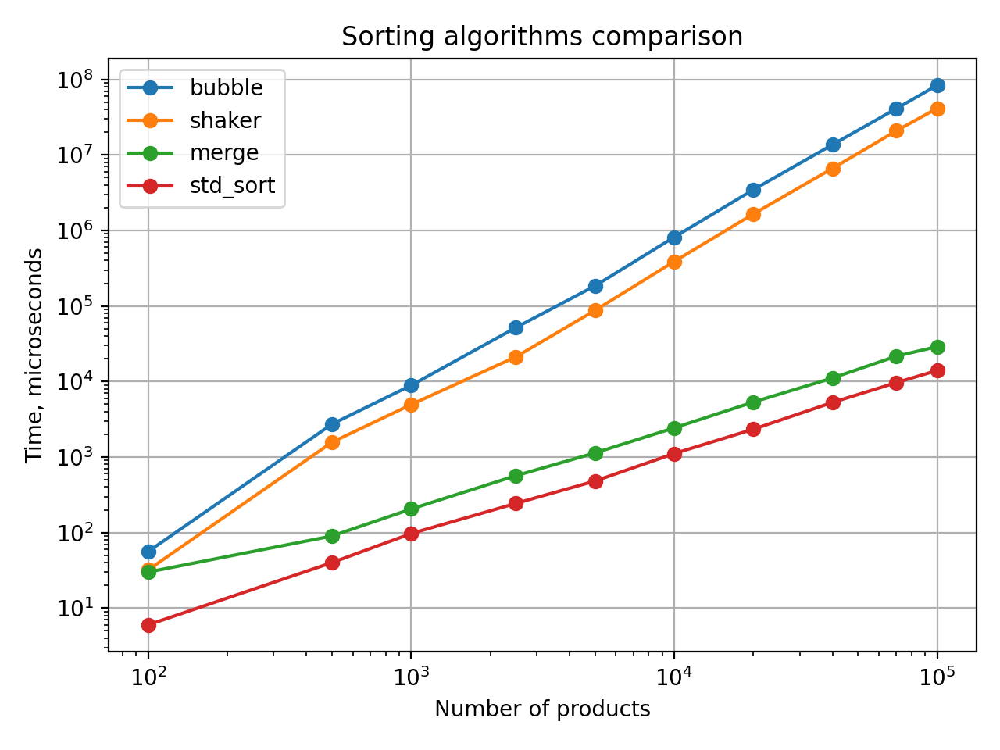

# Лабораторная работа №1

## Вариант

В работе выполнен вариант 9.

Массив данных описывает экспортируемые товары:

- наименование товара;
- страна, куда экспортируется товар;
- объем поставляемой продукции;
- сумма в рублях.

В программе этому соответствует структура `Product`:

```cpp
struct Product {
  std::string name;
  std::string country;
  int volume;
  double rubles;
};
```

Сравнение выполняется по полям:

```text
name -> volume -> country
```

Поле `rubles` хранится в записи, но не участвует в сравнении, так как в варианте оно не указано как ключ сортировки.

## Использованные сортировки

По варианту 9 реализованы:

- пузырьковая сортировка;
- шейкер-сортировка;
- сортировка слиянием.

Дополнительно для сравнения используется стандартная сортировка `std::sort`.

## Входные и выходные данные

Входные данные генерируются программой и записываются во внешние текстовые файлы вида:

```text
data/input<size>.txt
```

Например:

```text
data/input100.txt
data/input1000.txt
data/input100000.txt
```

После сортировки результаты записываются в файлы:

```text
data/bubbleOutput<size>.txt
data/shakerOutput<size>.txt
data/mergeOutput<size>.txt
data/stdSortOutput<size>.txt
```

Например, для размера 10000 создаются файлы:

```text
data/bubbleOutput10000.txt
data/shakerOutput10000.txt
data/mergeOutput10000.txt
data/stdSortOutput10000.txt
```

## Методика замера

Для проверки были выбраны 10 наборов данных:

```text
100, 500, 1000, 2500, 5000, 10000, 20000, 40000, 70000, 100000
```

Для каждого размера программа:

1. генерирует исходный файл с товарами;
2. считывает товары из файла;
3. копирует один и тот же исходный массив для каждой сортировки;
4. измеряет время сортировки через `std::chrono::high_resolution_clock`;
5. записывает отсортированный массив в отдельный файл;
6. проверяет, что результат действительно отсортирован.

Время измеряется в микросекундах.

## Результаты замеров

| Размер массива | Bubble sort | Shaker sort | Merge sort | std::sort |
|---:|---:|---:|---:|---:|
| 100 | 56 | 32 | 30 | 6 |
| 500 | 2729 | 1570 | 90 | 40 |
| 1000 | 8899 | 4957 | 205 | 97 |
| 2500 | 51761 | 21200 | 566 | 243 |
| 5000 | 184674 | 87302 | 1133 | 481 |
| 10000 | 815938 | 388011 | 2430 | 1111 |
| 20000 | 3463043 | 1653222 | 5343 | 2333 |
| 40000 | 13667787 | 6637055 | 11122 | 5285 |
| 70000 | 41097408 | 20880677 | 21649 | 9665 |
| 100000 | 83679518 | 41436616 | 28962 | 14001 |

## График

На графике показана зависимость времени сортировки от размера массива.
Обе оси построены в логарифмической шкале, потому что времена квадратичных сортировок и быстрых сортировок отличаются на несколько порядков.



## Вывод

Пузырьковая сортировка работает хуже всех. На массиве из 100000 элементов она выполнялась около 83.7 секунд. Это ожидаемо, потому что у нее сложность `O(n^2)`: при росте массива количество сравнений и перестановок растет очень быстро.

Шейкер-сортировка оказалась быстрее пузырьковой сортировки, потому что за один проход двигает элементы в обе стороны. Но асимптотически это та же квадратичная сортировка `O(n^2)`, поэтому на больших массивах она тоже становится слишком медленной.

Сортировка слиянием заметно быстрее пузырьковой и шейкерной сортировок на больших данных. Ее сложность `O(n log n)`, поэтому рост времени намного спокойнее.

`std::sort` показал лучший результат среди всех проверенных вариантов. Это связано с тем, что стандартная реализация хорошо оптимизирована и обычно основана на introsort.

Для маленьких массивов разница между алгоритмами не так критична, но для больших массивов лучше применять `std::sort` или алгоритмы со сложностью `O(n log n)`. Пузырьковую и шейкер-сортировку имеет смысл использовать только для учебных целей или очень маленьких массивов.

## Документация и исходный код

Doxygen-документация сгенерирована по комментариям в `src/main.cpp` и находится в:

```text
docs/html/index.html
```

Исходный код программы:

```text
src/main.cpp
```

Ссылка на репозиторий:

```text
https://github.com/pvmen/programming-methods/tree/feature/selfmade_lab-1
```
