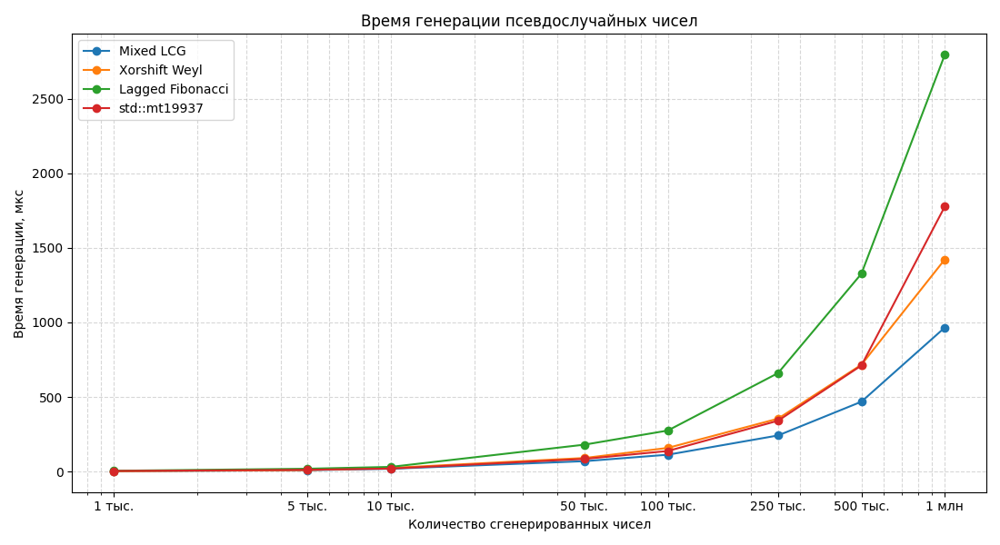
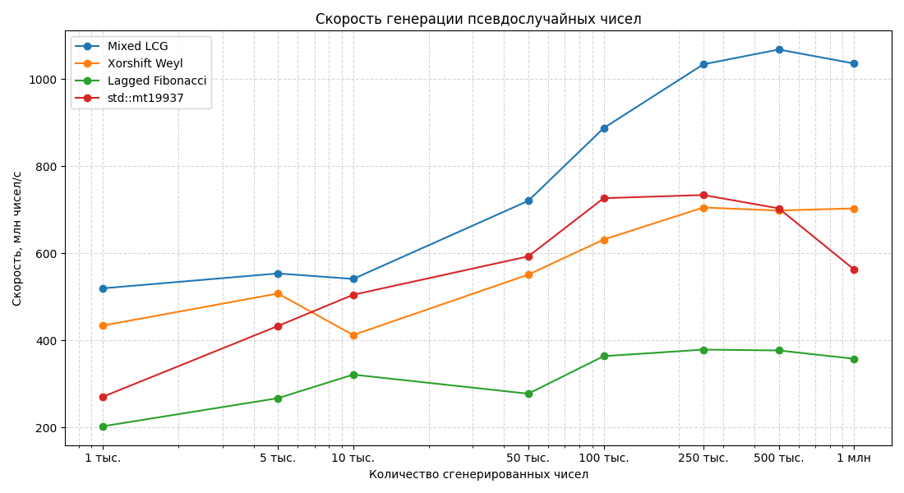
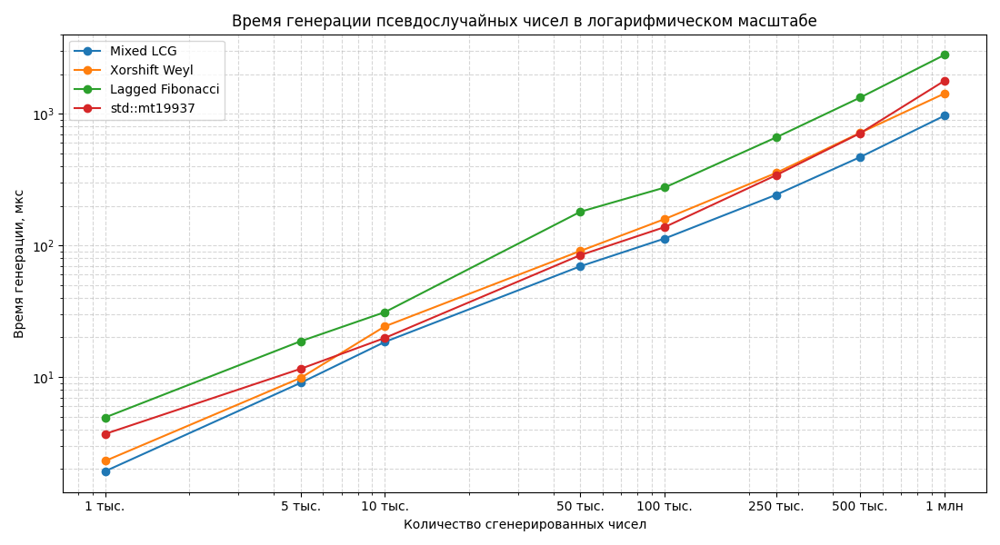

# Лабораторная работа №3

## Тема
Генерация и исследование псевдослучайных чисел.

## Реализованные методы генерации
- `mixed_lcg` - линейный конгруэнтный генератор с дополнительным перемешиванием битов.
- `xorshift_weyl` - генератор Xorshift с последовательностью Вейля.
- `lagged_fibonacci` - аддитивный генератор Фибоначчи с запаздываниями 24 и 55.
- `std_mt19937` - стандартный генератор C++ для сравнения скорости.

Диапазон чисел в выборках: от `0` до `9999`.
Для каждого собственного генератора получено по `20` выборок объемом `1000` элементов.

## Проверка выборок
Для каждой выборки посчитаны:
- среднее значение;
- среднеквадратичное отклонение;
- коэффициент вариации;
- критерий Хи-квадрат для равномерности распределения;
- критерий Хи-квадрат для частоты пар соседних значений.

Для проверки равномерности использовано `20` интервалов. Критическое значение при уровне значимости `0.05`: `30.144`.

Для проверки случайности использована таблица частот пар соседних чисел размером `10 x 10`. Критическое значение при уровне значимости `0.05`: `123.225`.

Итог по 20 выборкам:

| Генератор | Среднее | Отклонение | Коэффициент вариации | Равномерность | Случайность |
|---|---:|---:|---:|---:|---:|
| `mixed_lcg` | 4963.645 | 2881.699 | 0.580711 | 20/20 | 20/20 |
| `xorshift_weyl` | 5045.004 | 2891.708 | 0.573391 | 19/20 | 19/20 |
| `lagged_fibonacci` | 4994.694 | 2904.859 | 0.581879 | 19/20 | 20/20 |

Полные результаты сохранены в файле `data/sample_stats.txt`.

## Тесты NIST и Diehard
Для каждого алгоритма выполнено 5 тестов:
- Monobit Frequency;
- Runs;
- Block Frequency;
- Serial;
- Longest Run of Ones.

Результаты:

| Генератор | Monobit | Runs | Block frequency | Serial | Longest run |
|---|---:|---:|---:|---:|---:|
| `mixed_lcg` | прошел | прошел | прошел | прошел | прошел |
| `xorshift_weyl` | прошел | прошел | прошел | прошел | прошел |
| `lagged_fibonacci` | прошел | прошел | прошел | прошел | прошел |

Полные значения статистик сохранены в файле `data/random_tests.txt`.

## Измерение скорости
Скорость генерации измерялась через `std::chrono::high_resolution_clock`.
Проверены размеры от `1000` до `1000000` чисел.
Для уменьшения влияния погрешности таймера каждый замер выполнялся на `100` повторениях и затем приводился к времени генерации заданного количества чисел.
Результаты сохранены в `data/generation_times.txt`.

| Количество чисел | Mixed LCG | Xorshift Weyl | Lagged Fibonacci | std::mt19937 |
|---:|---:|---:|---:|---:|
| 1000 | 1925 | 2304 | 4931 | 3696 |
| 5000 | 9032 | 9851 | 18708 | 11548 |
| 10000 | 18482 | 24257 | 31117 | 19813 |
| 50000 | 69410 | 90752 | 180138 | 84349 |
| 100000 | 112698 | 158384 | 274902 | 137670 |
| 250000 | 241849 | 354624 | 660054 | 340750 |
| 500000 | 468308 | 716309 | 1326660 | 711211 |
| 1000000 | 965611 | 1422517 | 2795313 | 1777321 |

Единица измерения: наносекунды.

## Графики

## Анализ результатов
Средние значения всех генераторов близки к теоретическому среднему диапазона `0..9999`, то есть примерно к `4999.5`.
Отклонения находятся около `2880-2900`, что также соответствует равномерному распределению на выбранном диапазоне.

По критерию Хи-квадрат генератор `mixed_lcg` прошел все проверки равномерности и случайности.
У `xorshift_weyl` одна выборка не прошла проверку равномерности и одна проверку случайности.
У `lagged_fibonacci` одна выборка не прошла проверку равномерности, но все выборки прошли проверку случайности по парам соседних значений.

NIST/Diehard-like тесты показали более устойчивый результат: все три генератора прошли все пять тестов.
Это не противоречит проверке Хи-квадрат, потому что тесты проверяют разные свойства: Хи-квадрат проверяет распределение чисел и пар в конкретных выборках, а NIST/Diehard-like тесты проверяют битовый поток.

По скорости самым быстрым в большинстве крупных замеров оказался `mixed_lcg`.
`xorshift_weyl` также быстрый, но в этих измерениях уступил `mixed_lcg`.
`lagged_fibonacci` медленнее из-за работы с массивом состояния.
Стандартный `std::mt19937` показывает хорошую скорость и стабильность, но не всегда быстрее собственных простых генераторов.

## Вывод
Все три предложенных метода генерации реализованы и проверены.
По результатам статистических проверок все генераторы можно считать пригодными для учебного моделирования равномерных псевдослучайных чисел.
Лучший общий результат в этой работе показал `mixed_lcg`: он прошел все проверки Хи-квадрат, все тесты NIST/Diehard-like и оказался самым быстрым на больших объемах.

## Ссылка на репозиторий
https://github.com/pvmen/programming-methods/tree/feature/laba-3

Doxygen-документация: `docs/html/index.html`