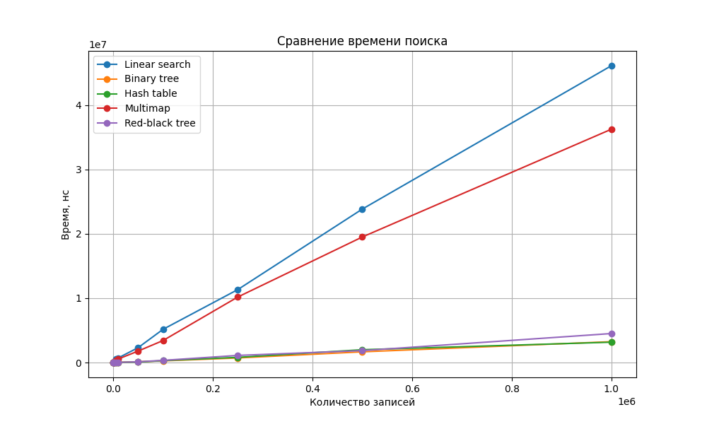
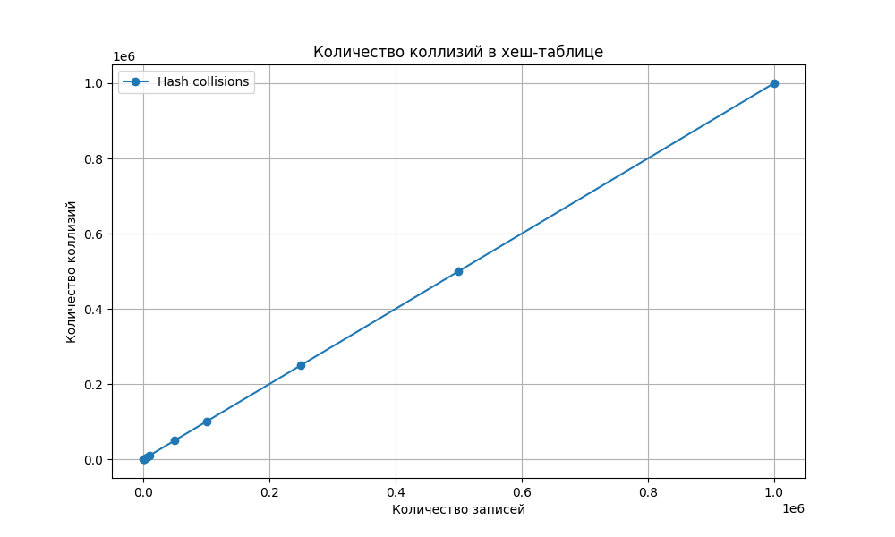

# Лабораторная работа №2

## Тема
Алгоритмы поиска данных.

## Вариант
Массив данных об экспортируемых товарах:
- наименование товара;
- страна экспорта;
- объем поставляемой продукции;
- сумма в рублях.

Ключ поиска: первое нечисловое поле объекта, то есть `name`.
В тестах выполнялся поиск всех товаров с ключом `Oil`.

## Реализованные методы поиска
- линейный поиск по массиву;
- поиск с помощью бинарного дерева поиска;
- поиск с помощью красно-черного дерева;
- поиск с помощью хеш-таблицы;
- поиск в `std::multimap` для сравнения.

Все основные структуры поиска реализованы самостоятельно. Для хеш-таблицы используется метод цепочек: таблица хранит массив корзин, а каждая корзина содержит список элементов с одинаковым хеш-индексом. Коллизия считается при вставке записи в уже занятую корзину.

## Входные данные
Данные генерируются программой и записываются в файлы вида `data/search_input<size>.txt`.
Использованы массивы размером от `100` до `1000000` записей.

## Измерение времени
Время измеряется программно через `std::chrono`.
Для дерева поиска, красно-черного дерева, хеш-таблицы и `multimap` построение структуры выполняется до начала замера. В таблицу записывается именно время поиска.

Результаты сохраняются в файл `data/search_times.txt`.
Единица измерения времени: наносекунды.

## Результаты замеров

| Размер массива | Линейный поиск | Бинарное дерево | Хеш-таблица | Multimap | Красно-черное дерево | Коллизии |
|---:|---:|---:|---:|---:|---:|---:|
| 100 | 24334 | 1042 | 750 | 9917 | 625 | 97 |
| 500 | 41000 | 2000 | 2458 | 33167 | 2458 | 497 |
| 1000 | 38959 | 5542 | 4042 | 68041 | 5625 | 997 |
| 5000 | 495666 | 21333 | 19375 | 330917 | 19959 | 4997 |
| 10000 | 712000 | 24708 | 19708 | 542875 | 19083 | 9997 |
| 50000 | 2308500 | 126292 | 70875 | 1779959 | 120208 | 49997 |
| 100000 | 5157250 | 256542 | 298417 | 3416084 | 336167 | 99997 |
| 250000 | 11327333 | 709167 | 805375 | 10174000 | 1106708 | 249997 |
| 500000 | 23836417 | 1661250 | 1991792 | 19499042 | 1848333 | 499997 |
| 1000000 | 46103084 | 3238041 | 3160125 | 36241083 | 4501291 | 999997 |

## Графики

## Анализ результатов
Линейный поиск работает медленнее на больших массивах, потому что просматривает все элементы массива.

Бинарное дерево поиска, красно-черное дерево и хеш-таблица выполняют поиск быстрее, так как данные предварительно организованы в структуры, ускоряющие доступ по ключу.

`std::multimap` оказался медленнее собственных деревьев и хеш-таблицы в этих замерах. Это связано с накладными расходами стандартной структуры и тем, что по ключу `Oil` возвращается большое количество элементов.

Количество коллизий в хеш-таблице растет почти линейно с размером массива. Причина в том, что в генераторе используется только четыре разных названия товара, поэтому после заполнения первых корзин почти каждая новая вставка попадает в уже занятую корзину.

## Вывод
Все требуемые методы поиска реализованы и находят все вхождения заданного ключа.
На больших массивах линейный поиск проигрывает структурам данных, которые заранее организуют элементы по ключу.
Самыми быстрыми в эксперименте оказались хеш-таблица и деревья поиска.

## Ссылка на репозиторий
https://github.com/pvmen/programming-methods/tree/feature/laba-2

Doxygen-документация: `docs/html/index.html`