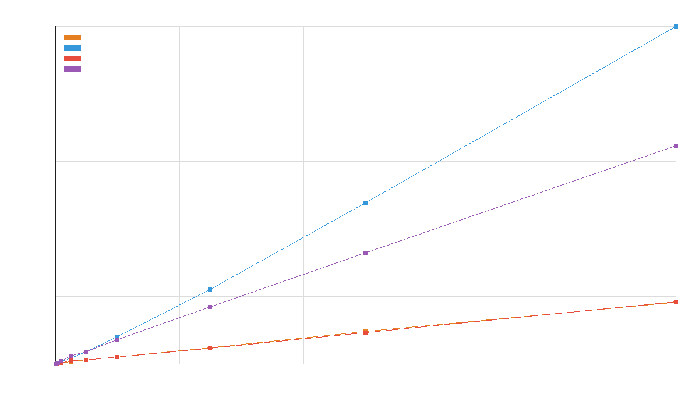

# Отчет по практической работе 1

## Вариант

Вариант 9: массив данных об экспортируемых товарах.

Поля записи:

- наименование товара;
- страна, куда экспортируется товар;
- объем поставляемой продукции;
- сумма в рублях.

Сравнение объектов выполняется лексикографически по полям:

1. наименование товара;
2. объем поставляемой продукции;
3. страна.

Сумма в рублях хранится в записи и выводится в CSV, но в сравнении не участвует.

## Реализованные сортировки

- Сортировка пузырьком.
- Шейкер-сортировка.
- Сортировка слиянием.
- `std::sort` как эталон стандартной библиотеки.

Все сортировки работают с `std::vector<ExportedProduct>` через перегруженные операторы сравнения.

## Входные и выходные данные

Входные данные читаются из CSV-файлов `data/input_<N>.csv`.

После запуска бенчмарка создаются:

- `output/sorted_bubble_<N>.csv`;
- `output/sorted_shaker_<N>.csv`;
- `output/sorted_merge_<N>.csv`;
- `output/sorted_std_sort_<N>.csv`;
- `output/benchmark.csv`.

График строится командой:

```bash
python3 scripts/plot_benchmark.py
```

Результат сохраняется в `output/benchmark.png`.



## Выводы

Сортировка пузырьком и шейкер-сортировка имеют квадратичную сложность в общем случае, но в этой работе для набора до 100000 элементов используются почти отсортированные данные. На таких данных обе простые сортировки завершаются быстро благодаря раннему выходу после прохода без обменов.

По полученному графику для почти отсортированных массивов лучше всего подходят пузырек и шейкер-сортировка. Для произвольных и случайно перемешанных данных надежнее применять сортировку слиянием или `std::sort`, так как они работают за `O(n log n)`. Сортировка слиянием стабильна, но требует дополнительную память `O(n)`.

## Документация

Исходный код программы находится в репозитории:

https://github.com/pvmen/programming-methods

Doxygen-документация генерируется командой:

```bash
doxygen Doxyfile
```

HTML-файлы появятся в `docs/html`.
